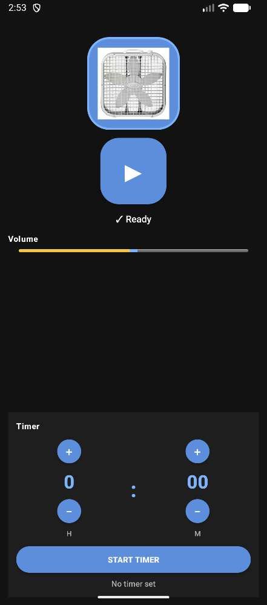

# BoxFan - Simple Fan Sound Sleep Timer


A lightweight Android application that plays ambient fan noise with an integrated sleep timer. Perfect for relaxation and creating a peaceful sleep environment.

## Features

- **Audio Playback**: Play soothing fan noise from a local audio asset
- **Volume Control**: Adjust volume using the on-screen slider or hardware volume buttons
- **Sleep Timer**: Set a sleep timer with flexible hour and minute increments (0-23h, 0-59m)
- **Timer-Audio Sync**: Audio automatically pauses when the timer completes; resuming audio also resumes the timer
- **Responsive UI**: Automatically adapts between portrait and landscape orientations
- **Background Playback**: Continues playing audio even when the app is in the background
- **Status Display**: Real-time feedback on audio state (Loading, Ready, Playing, Paused)

## Quick Start

**Option 1: Build and Install Directly**

```bash
./gradlew installDebug
```

This builds and installs the app directly to your connected device or emulator.

**Option 2: Download APK**

After building, the APK is located at:

```
app/build/outputs/apk/debug/app-debug.apk
```

Copy this file to your device and install it, or rename it to `BoxFan.apk` for easier identification.

## Requirements

- Android 8.0 (API 26) or higher
- Minimum ~10MB free storage for app installation
- Microphone permissions not required

## Build & Installation

### Using Android Studio

1. Clone or open the project in Android Studio
2. Connect an Android device or start an emulator (Android 8.0+)
3. Click **Run** → **Run 'app'** or press `Shift + F10`
4. The app will build, install, and launch automatically

### Using Command Line

```bash
./gradlew installDebug
```

## Usage

### Getting Started

Once the app launches, you'll see the ready state:



### Setting a Sleep Timer

Configure your timer with flexible increments:


### Controls

1. **Play Audio**: Tap the play button (▶) to start fan noise. The button changes to pause (⏸) when playing.

2. **Control Volume**: 
   - Slide the volume control left/right
   - Or use your device's hardware volume buttons

3. **Set Sleep Timer**:
   - Select hours using the hour increment buttons
   - Select minutes using the minute increment buttons
   - Tap "Start Timer" to begin
   - The countdown displays in the timer section

4. **Pause/Resume Timer**: You can pause the audio at any time, and the timer will pause with it. Resuming audio resumes the timer.

## Technical Details

- **Audio**: Uses Android's MediaPlayer for playback
- **Service**: Runs as a foreground service to ensure playback continues in the background
- **Permissions**: Requires WAKE_LOCK and MODIFY_AUDIO_SETTINGS
- **Storage**: Audio file extracted from app assets to cache directory on first launch

## Notes

- The sleep timer automatically pauses the audio when time is up
- Audio focus is properly managed to avoid conflicts with other audio applications
- The app handles screen rotation gracefully with responsive layouts for both portrait and landscape modes

---

**Version**: 1.0  
**Minimum SDK**: Android 8.0 (API 26)
